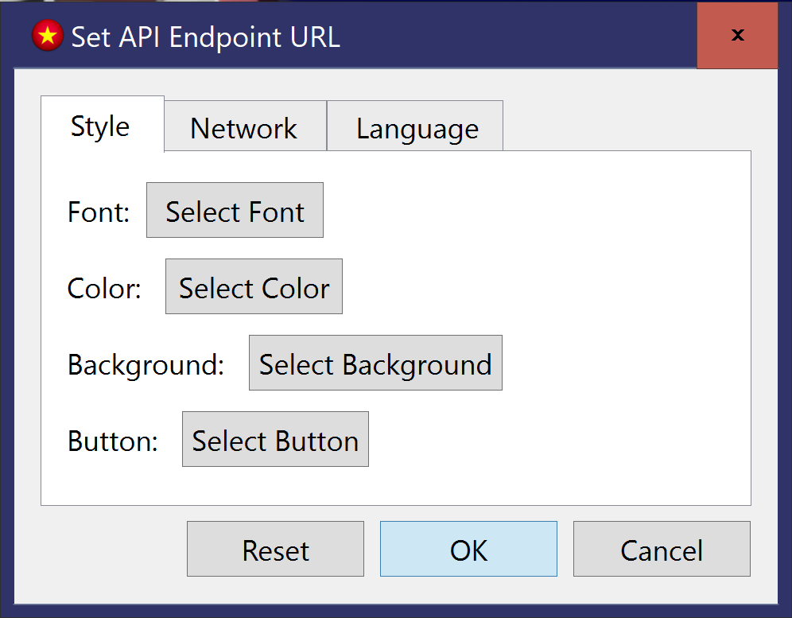

# ViFlashCard

ViFlashCard is a Vietnamese flashcard app for Vietnamese learners.

The app randamly selects Vietnamese words from <a href="https://botudien.pythonanywhere.com/" title="Botudien">Botudien</a> site. 

The API URL is custamizable.

Not only URL is custamizable. The main screen is custamizable.

All the words shown are recorded and accessible from <code>File|Word List</code>. 

For all info on <a href="https://botudien.pythonanywhere.com/" title="Botudien">Botudien</a>, follow the link.

